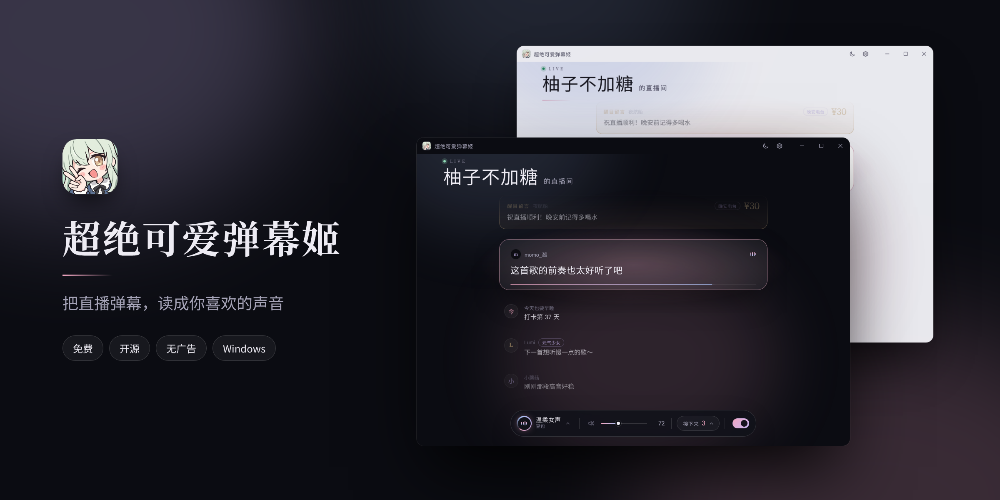
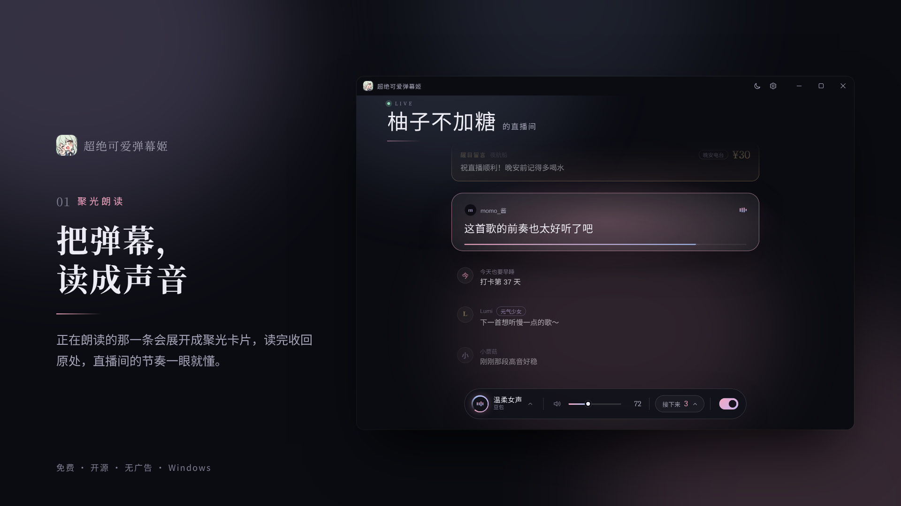
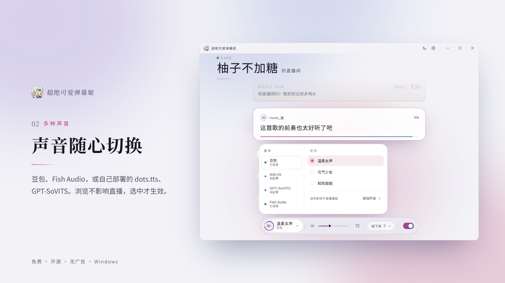
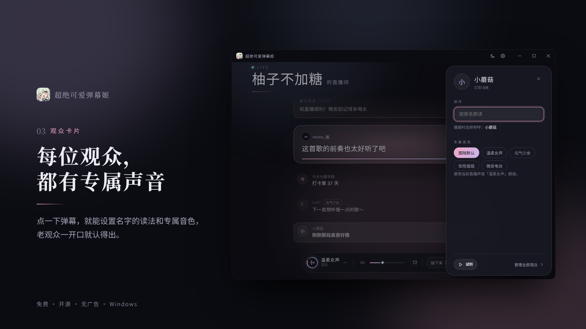
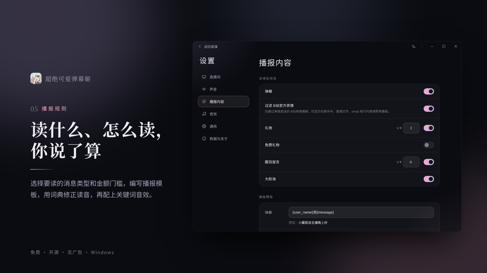
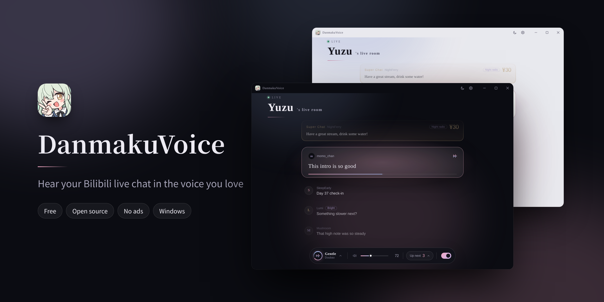

<div align="center">



# 超绝可爱弹幕姬

**把 B 站直播弹幕，读成你喜欢的声音。**

[**从 Microsoft Store 获取**](https://apps.microsoft.com/detail/9P4DFD8HGN03) · [English](#english) · [隐私说明](docs/PRIVACY.md) · [问题反馈](https://github.com/Ghou133/DanmakuVoice/issues)


</div>

超绝可爱弹幕姬是一款 Windows 桌面工具：接收哔哩哔哩直播间的弹幕、礼物、醒目留言和上舰消息，按你定的规则用喜欢的声音读出来。正在读的那一条会放大成聚光卡片，排在后面的一目了然；不想听的时候关掉播报，弹幕照常显示。

## 亮点

|            |                                                              |
| ---------- | ------------------------------------------------------------ |
| **聚光朗读**   | 正在朗读的弹幕展开成卡片，读完收回原处；同一观众的连续发言自动合并，间隔久了插入时间分隔。                |
| **多种声音**   | 豆包扫码即用；Fish Audio 填写 API Key；也可以连接自己部署的 dots.tts、GPT-SoVITS。 |
| **观众专属**   | 点一下弹幕，设置名字怎么读、用哪个音色。老观众一开口就认得出。                              |
| **播报规则**   | 选择读哪些消息、礼物和醒目留言的金额门槛；编写播报模板；用词典修正读音；配上关键词音效。                 |
| **待读列表**   | 排队中的弹幕随时可见，点选任意一条立即朗读。                                       |
| **好看，也好用** | 夜幕／晨雾两套主题，简体中文／English 界面，设置改动自动保存。                          |

<table>

  <tr>

    <td width="50%"></td>

    <td width="50%"></td>

  </tr>

  <tr>

    <td width="50%"></td>

    <td width="50%"></td>

  </tr>

</table>

## 安装

在 [Microsoft Store](https://apps.microsoft.com/detail/9P4DFD8HGN03) 安装，更新也由商店管理；可用版本与上架状态以商店页面为准。

- 系统：Windows 10 2004 或更新版本 / Windows 11，x64
- 需要 Microsoft Edge WebView2 Runtime（Windows 11 已自带）
- 音频组件 FFmpeg 随安装包提供，无需另行配置

## 三步上手

1. **连接直播间**：扫码登录哔哩哔哩，自动找到自己的直播间。匿名接收与手动主播 UID 入口已关闭。
2. **选择声音**：用豆包朗读，或先只看弹幕，之后随时可以打开。
3. **开始接收**：确认后进入直播界面。以后启动会自动尝试连接上次的直播间。

主界面底部的控制坞可以切换音色、调节音量与静音、查看待读列表、开关弹幕播报。其他语音服务、规则和音效都在设置里。

实验性功能在「设置 → OBS 与开播」。启用开播台后，可以在主界面开播／下播、发送文字弹幕和表情，点头像禁言、直播拉黑或任免房管（按账号权限）。右上角「直播详情」可保存 OBS 下次开播的码率，并在叠加层启用时修改主标题。详见 [开播说明](docs/BROADCAST.md)。

## 语音服务

| 服务         | 怎么连接              | 说明                                   |
| ---------- | ----------------- | ------------------------------------ |
| 豆包         | 应用内扫码登录           | 选择音色即可使用                             |
| Fish Audio | 在设置中填写自己的 API Key | 可选内建或自定义音色；自动使用 Windows 中已启用的代理服务器设置 |
| dots.tts   | 选择已安装的服务目录与参考音频   | 服务与模型需自行准备，参考音频保留在原位置                |
| GPT-SoVITS | 选择已安装的服务目录        | 自动配对角色模型；服务与模型需自行准备                  |

第三方服务可能需要独立账号、API Key 或自行部署，服务商可能另行收费。本应用不包含语音模型，也不提供第三方账号或额度。

## 使用小贴士

- **观众卡片**：点击任意弹幕打开，设置“读作”和专属音色；已设置专属声音的观众，名字旁会显示音色标签。也可以在“设置 → 声音”里按用户名或 UID 管理。
- **关闭播报不等于断开**：关掉播报开关后弹幕照常接收和显示；连接管理在“设置 → 直播间”。
- **OBS 与开播（实验）**：开播台和 OBS 叠加层合并在“设置 → OBS 与开播”，顶部是共用的 OBS 连接（OBS 28+ 自带的 WebSocket）。
- **开播台**：启用后主界面右上角出现开播台：一键开播/下播、直播计时、点标题改标题和分区，并处理人脸验证。开启“OBS 联动”后，开播会自动启动 OBS（如未运行）、填好推流码并开始推流，下播先停 OBS 再关直播间；也可以照旧复制推流码。详见 [开播](docs/BROADCAST.md)。
- **OBS 叠加层**：启用后点“添加到 OBS”即可在 OBS 当前场景放好浏览器来源（也可复制本机地址手动添加），显示弹幕、醒目留言和朗读进度；支持样式、位置、标题及显示项目设置。开播和叠加层默认关闭，真实账号开播及 OBS 推流验收仍待完成。
- **界面语言**：在“设置 → 通用 → 界面语言”切换，立即生效。界面语言不会改变弹幕原文、用户名、音色名称或你写的播报模板。
- **后台运行**：最小化或切到后台时，界面暂停刷新，接收与播报继续。托盘菜单提供“显示窗口”和“退出”。
- **本地服务**：由本程序启动的 dots.tts／GPT-SoVITS 会在退出时一并关闭；你自己启动的外部服务不受影响。
- **音频设备**：设备断开后，可在“设置 → 通用 → 音频输出”刷新或重新连接（重新连接会停止当前播放和待读队列）。

## 隐私与数据

- 数据保存在 Windows 当前用户的 `AppData\Local\DanmakuVoice`，通过系统 Known Folder API 定位，独立于 EXE 文件名、版本、安装位置和工作目录。别名和专属声音绑定随数据库保存；商店包也使用该目录。登录凭据和 API Key 使用 Windows 当前用户范围的 DPAPI 加密保存。
- 应用没有开发者运营的数据收集服务器、广告或使用统计。待播报文字只会发送给你选择的语音服务。
- “设置 → 数据与关于”可以导入旧配置、导出普通配置（不含凭据、音效文件和聊天记录）或清除应用数据。迁移说明见 [MIGRATION.md](MIGRATION.md)。
- 请不要公开分享整个数据目录。完整说明见 [隐私说明](docs/PRIVACY.md)。

想用一份独立的数据试用，可以指定另一个数据目录：

```powershell
.\DanmakuVoice.exe --data-dir "D:\DanmakuVoice-Test"
```

## 问题反馈

报错会显示中文说明和末尾的短代码，例如 `音频组件 FFmpeg 无法启动… [DV-C02]`。[提交问题](https://github.com/Ghou133/DanmakuVoice/issues)时请附上程序版本、操作步骤和完整报错截图（保留错误代码）。**不需要、也请不要**提供 Cookie、API Key 或整个数据目录。错误码对照见 [ERROR-CODES.md](docs/ERROR-CODES.md)。

哔哩哔哩与豆包使用网页接口，接口变化可能影响登录与连接。

## 从源码构建

需要 Windows x64、[指定版本的 Rust 工具链](rust-toolchain.toml)、Visual Studio C++ 构建工具和 Windows SDK。界面随程序嵌入，不需要 Node.js 运行时。

```powershell
cargo build --locked --release -p danmakuvoice
cargo test --locked --workspace
```

发行包使用静态 CRT，构建与音频组件说明见 [FFMPEG.md](docs/FFMPEG.md)。同版 `DanmakuVoice-source.zip` 包含锁定的依赖和 FFmpeg 源码，解压后运行 `scripts/build-from-source.ps1 -VerifyOnly` 核验，或运行 `scripts/build-from-source.ps1` 离线构建（仍需预先安装工具链和 Windows SDK）。

GitHub Actions 会在提交、PR 和版本标签上执行验证，生成商店提交用的 MSIX 和同提交的完整源码包；不会自动提交微软审核，也不会把未签名的安装包当作正式版本发布。商店流程见 [STORE-PUBLISHING.md](docs/STORE-PUBLISHING.md)。

开发文档：[架构](ARCHITECTURE.md) · [界面设计与验收](docs/UI-DESIGN.md) · [桌面命令](docs/UI-IPC.md) · [发行材料核验](docs/RELEASE-LICENSE-AUDIT.md) · [进度与验证记录](PROGRESS.md)

## 许可与致谢

- 代码采用 [AGPL-3.0-only](LICENSE)。正式分发须提供对应的完整源码。
- 功能与旧配置格式参考了 [kinoko7danmaku](https://github.com/MerlinCN/kinoko7danmaku)（GNU AGPL v3 © MerlinCN）及其 [Ghou133 分支](https://github.com/Ghou133/kinoko7danmaku)；本项目独立维护。
- FFmpeg 以独立子进程运行，使用 LGPL 2.1 或更高版本。第三方组件与素材说明集中在 [NOTICE.md](NOTICE.md)。
- 应用图标为插画作品，作品与角色权利归原权利人，代码许可证不授予这些权利；说明见 [ARTWORK.md](crates/desktop/icons/ARTWORK.md)。

本项目为独立开发，与哔哩哔哩、豆包、Fish Audio 无官方隶属关系。预览图中的用户名、直播间和弹幕均为虚构示例。

---

<a id="english"></a>

<div align="center">



## DanmakuVoice

**Hear your Bilibili live chat in the voice you love.**

[**Get it from Microsoft Store**](https://apps.microsoft.com/detail/9P4DFD8HGN03)

</div>

DanmakuVoice (超绝可爱弹幕姬) is a free, open-source Windows app that receives chat messages, gifts, Super Chats and memberships from a Bilibili live room and reads them aloud with the voice you choose.

- **Spotlight reading** – the message being read opens into a card and folds back when it is done.
- **Many voices** – Doubao (sign in by QR code), Fish Audio (your own API key), or your self-hosted dots.tts and GPT-SoVITS.
- **Per-viewer voices** – click a message to set how a name is pronounced and which voice that viewer gets.
- **Your rules** – choose message types and amount thresholds, write templates, fix pronunciations with dictionaries, add keyword sounds.
- **Up next** – see the queue and pick any message to read it right away. Turning speech off keeps the chat on screen.
- **Night and Mist themes**, Simplified Chinese and English interface, settings saved automatically.

**Requirements:** Windows 10 2004 or later / Windows 11 (x64) and Microsoft Edge WebView2 Runtime. FFmpeg is bundled.

**Getting started:** scan to sign in or enter a streamer UID (not the room number), choose Doubao or chat-only mode, then start. Other voice services are in Settings.

**Privacy:** data lives in `%LOCALAPPDATA%\DanmakuVoice`; credentials and API keys are encrypted with Windows DPAPI for the current user. There is no developer-run telemetry or advertising. Text to be spoken is sent only to the voice service you choose. See the [privacy notes](docs/PRIVACY.md) (Chinese).

**Build from source:** Windows x64, the pinned [Rust toolchain](rust-toolchain.toml), Visual Studio C++ build tools and the Windows SDK.

```powershell
cargo build --locked --release -p danmakuvoice
cargo test --locked --workspace
```

**License:** [AGPL-3.0-only](LICENSE). Third-party notices are in [NOTICE.md](NOTICE.md). DanmakuVoice is an independent project and is not affiliated with Bilibili, Doubao or Fish Audio. Names and messages shown in the preview images are fictional.
